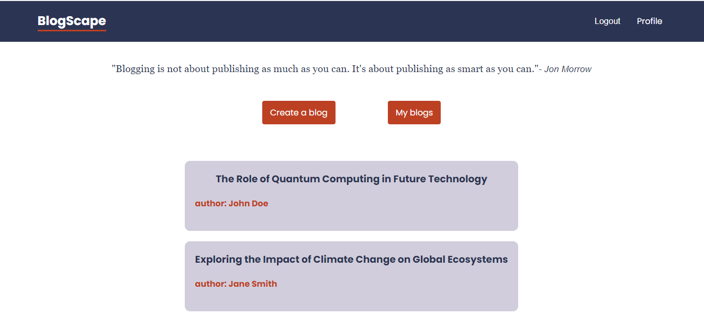

# MERN Stuck Blog Platform

## Description
MERN Stuck is an innovative blog platform offering an intuitive and comfortable blogging and sharing experience. The application allows viewing blogs without registration but requires sign-up and login to create and manage personal blogs.

## Features
- **Blog Viewing:** Accessible to all users, no registration required.
- **Account Creation:** Sign up to start writing and sharing blogs.
- **Account Management:** Edit your details, change your password, and manage your email address.
- **Blog Creation and Management:** Write, edit, and delete your blogs with ease.

## Installation
To install MERN Stuck locally:
1. **Download:** Download the code from our repository.
2. **.env File:** Create a local `.env` file and set `MONGODB_URI` with your database address and `JWT_SECRET` with your JWT password.
3. **Execution:** Run the `npm start` command from the root directory. Alternatively, run `npm start` separately in the backend and frontend directories.
